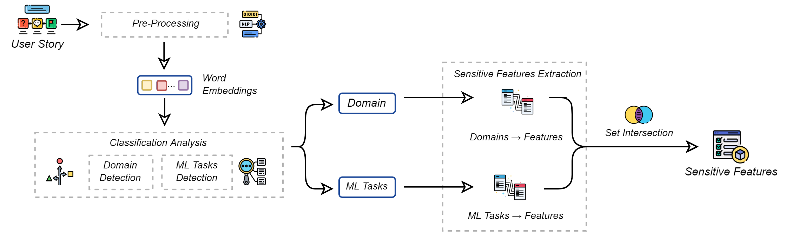
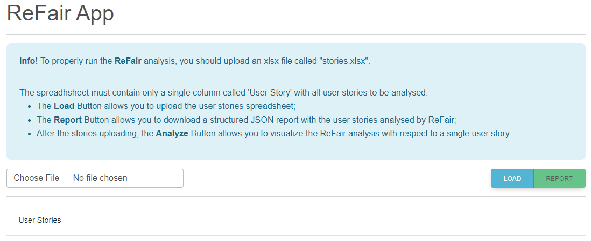

# ReFair-App
Web App for ReFAIR: Toward a Context-Aware Recommender for Fairness Requirements Engineering

**Main Contributor**: Carmine Ferrara - <a href="https://github.com/CFerrara98">https://github.com/CFerrara98</a>

<div style="text-align:center"></div>

ReFair is a novel Solution designed to assist Data Scientists and Software Engineers in building fair Machine Learning (ML) solutions. Its primary objective is to recommend potential sensitive features that could affect the fair behavior of an ML-intensive system during development.

<div style="text-align:center"></div>
The main idea behind ReFair is to analyze a User Story by identifying the application domain and the potential ML tasks required. Based on this information, ReFair suggests possible sensitive features for each task detected that are typically impactful in the identified domain.

Main repository: <a href="https://anonymous.4open.science/r/ReFAIR-Toward-a-Context-Aware-Fairness-Recommender-in-Requirement-Engineering-18C7"> ReFair </a>

Unlike the ReFair CLI application that we released with the main document, the Web App offers the following additional functionalities:

<ul>
  <li>Load an entire requirements specification (as a structured spreadsheet) to analyize instead a single user story;</li>
  <li>Download a structured JSON report that contains the ReFair's analysis details of the loaded user stories;</li>
  <li>Visualize the user stories in a structured table;</li>
  <li>Analyze a single user story and visualize the ReFair analysis results in a structured pop-up;</li>
  <li>Download fa structured JSON report of a single user story analysis after visualizing the details in the related pop-up.</li>
</ul>

# Instructions to run the web app
First of all, clone the repository or download it as a zip.

## Instruction to run the Application Server
To run the application server that wraps the ReFair models and business logic, please install a stable <a href = "https://www.python.org/downloads/">python version</a> (we tested the compatibility of our application with the python versions 3.9 and 3.10). In addition, please download and put under refair-server/models folder the file glove.6B.100d.txt at the following link : <a href ="https://www.kaggle.com/datasets/danielwillgeorge/glove6b100dtxt"> Kaggle Download</a>.

After installing python and adding the required glove dependency, please open a command prompt in the main folder and move to the server directory using the following command:

```bash
cd refair-server
```

than create a new virtual environment, activate it, and install the required dependencies using the following bash commands:

```bash
python -m venv env 

./env/Scripts/Activate

pip install -r requirements.txt
```

and finally run the server using the command:

```bash
python -m flask run --port=5001 --debug
```
If you correctly the procedure, you should correctly visualize an instance of the application server ready to recieve the HTTP request from the client application.

---------------
Application Client
After you successfully runned the server, we can follow a simila procedure to run the client app, using the following similar procedure.

First of all, you need to install Node and NPM from the official <a href = "https://nodejs.org/en/download"> web site </a>(we tested the compatibility of our application with the Node.js version 18.17.1).
Successively, please open another shell that points on the main folder of the repository and move to the client subfolder using the following command:

```bash
cd refair-client
```
Finally install the required dependencies and run the client with the following bash instructions:

```bash
npm install
npm run dev
```

In the end if you correctly run the server and the client, you can interact with the ReFair pipeline by following the instructions we reported in the main info box of the client interface:
<div style="text-align:center"></div>
